# OmicsCanvas: A Multi-Omics Integration & Visualization Toolkit

[](https://www.python.org/)
[](LICENSE)
[](CONTRIBUTING.md)

**A gene-architecture–aware framework to align, normalize, discover patterns, and visualize multi-omics regulation in a unified “promoter–gene body–flanks” coordinate system.** 

## 📖 Introduction
OmicsCanvas is a Python (v3.9) toolkit for integrated analysis of transcriptomic, epigenomic, and epitranscriptomic sequencing data. It takes peak-centric assays (e.g., ChIP-seq/ATAC-seq/m6A-seq) and projects their signals onto a standardized gene-architecture model, producing interpretable gene-centric matrices and publication-ready vector figures (PDF/SVG).

## 🔑 Key capabilities
- **Standardized inputs**: sorted/indexed **BAM** tracks (RNA-seq/ChIP-seq/ATAC-seq/m6A-seq, etc.), **GFF/BED** annotations, and **Bismark CX** methylation reports.  
- **Unified binning & matrix construction**: partitions each gene into body + flanks and discretizes into configurable bins (default **300**), generating unified *element × bin* signal matrices with optional library-size normalization. 
- **Expression & methylation integration**: outputs TPM/FPKM/count matrices and computes bin-level **CG/CHG/CHH** methylation profiles to directly connect regulatory layers with transcriptional output. 
- **Pattern discovery**: supports **K-means** to identify coordinated multi-track patterns and produce clustered heatmaps + profile summaries. 
- **Publication-ready visualization**: generates genome-wide metaplots/heatmaps and single-gene plots in **2D**, **pseudo-3D**, and **circular** layouts, with group-wise shared y-axis scaling for consistent comparisons.
- **Extended modules**: includes differential expression analysis via **PyDESeq2** and supports **TE-centric** quantification when TE annotations are provided.

---

## 📦 Installation

OmicsCanvas follows a minimal-dependency philosophy.

### Option A: Conda / Mamba (Recommended)
```bash
# Create environment
mamba create -n omicscanvas python=3.9 -y
mamba activate omicscanvas

# Install core scientific stack & bioinformatics tools
mamba install -c conda-forge numpy pandas matplotlib seaborn scipy scikit-learn -y
mamba install -c bioconda pysam -y
```

### Option B: Pip

```bash
pip install numpy pandas matplotlib scipy scikit-learn pysam seaborn
```


## 🚀 Usage & Workflow
The OmicsCanvas workflow consists of three main stages: Preparation, Matrix Calculation, and Visualization.


### Step 1: Preparation
#### 1.Convert your annotation (GFF3) into standard BED format and calculate gene lengths.
```bash

python scripts/omicscanvas_gff_to_bed_genes_length.py 
  -i annotation.gff3 \
  -o gene.bed \
  -l gene_cds_length.tsv \
```
#### 2. Methylation Data Preprocessing (Bismark CX Reports)
Extract and filter site-specific methylation data (CG, CHG, and CHH contexts) from Bismark CX reports.

**Functionality:**
* Splits the global CX report into context-specific files (`CG`, `CHG`, `CHH`).
* Filters out high-depth noise (default threshold: depth > 300).
* Removes non-methylated sites (methylation count = 0) to reduce data redundancy.

```bash
# Extract and split methylation contexts
python scripts/02_prepare_cx_context_split.py \
  -i meth/sample_1_bismark_hisat2.CX_report.txt \
  -p sample \
  -d meth_data
```

Output: This script generates three context-specific files in the designated directory:
sample_CG.CX,sample_CHG.CX,sample_CHH.CX

Each output file is tab-delimited with 4 columns:
1.Chromosome
2.Position
3.Methylated read counts
4.Coverage / depth

#### 3. Integration of Biological Replicates (Optional Step)
Combine multiple context-specific CX files from biological replicates into a single consensus file to improve data coverage and statistical confidence.

```bash
python scripts/03_prepare_cx_replicate_merge.py \
  -o meth_data/treatment_CG.CX \
  meth_data/treatment_rep1_CG.CX \
  meth_data/treatment_rep2_CG.CX
```


### Step 2: Matrix Generation
#### 1. For BAM Files (ChIP / ATAC / TFs / m6A-seq)
Convert sorted BAM files into gene-centric coverage matrices (Promoter, Body, Terminator).


```bash
python scripts/omicscanvas_bam_to_gene_matrices.py \
  -b Sample_H3K4me3.sorted.bam \
  -g gene.bed \
  --outdir matrices \
  --distance 2000 \
  --outdir caculate_matrix
  -o Sample_H3K4me3
```

> **Output:** This process generates three core matrix files: `Sample_H3K4me3_tss_matrix.tsv`, `Sample_H3K4me3_gene_profile_matrix.tsv`, and `Sample_H3K4me3_tes_matrix.tsv`.


#### 2. For Methylation (WGBS)
Process CX reports into gene-centric methylation matrices.

```bash
python scripts/cx_gene_matrix.py -s sample -c CG -b gene.bed --cx-dir meth_data -o CX_gene
```

> **Output:** This process generates three core matrix files: `_tss_matrix.tsv`, `_gene_profile_matrix.tsv`, and `_tes_matrix.tsv`.

### 🎨 Visualization Gallery

#### 📊 Global Multi-Omics Profile (Pseudo-3D)
The 10_plot_whole_profile_2d3d.py script visualizes the genome-wide distribution of histone modifications or chromatin accessibility. It aggregates genes × bins matrices (via mean/median) into 1D meta-profiles and supports two sophisticated visualization modes:
  * 2D mode: vertically stacked panels;
  * 3D mode: stacked “fake-3D” panels in a column using x/y offsets and vertical dashed connectors.

---
##### 📂 Input Matrices (Source & Naming)

Matrices are typically pre-computed (e.g., via `06_compute_cx_gene_matrix.py`). The script dynamically loads files using the following mapping logic:

**Path Construction:**
`Path = <matrix-dir> / <sample_prefix> + <suffix>`


| Gene Type (`--gene-type`) | Standard Suffix | Description |
| :--- | :--- | :--- |
| `tss` | `_tss_matrix.tsv` | Transcription Start Site window |
| `gene` | `_gene_profile_matrix.tsv` | TSS + Scaled Gene Body + TES |
| `tes` | `_tes_matrix.tsv` | Transcription End Site window |

> **💡 Note:** The `sample_prefix` is parsed directly from the names provided in your `--group` argument. Ensure the file names in your directory strictly match this prefix.

---

#### 🛠 Layout Syntax: The Core Logic

The script uses a unique "Layout Language" for `--group`, `--names`, and `--ylabels`. Mastering the separators is critical for organizing your plot:

##### 🔗 Separator Rules
* **`,` (Comma)**: Groups multiple samples into the **same panel** (rendered as multiple lines).
* **`;` (Semicolon)**: Stacks **panels** vertically within the same column.
* **`|` (Pipe)**: Starts a **new column**.

##### ⚠️ Hard Rules
1.  **Strict Symmetry**: `--names` must mirror the structure of `--group` exactly (identical column, panel, and line counts).
2.  **Label Mapping**: `--ylabels` defines exactly one label per panel (use `;` and `|` to separate, **do not** use commas).

---

#### 🚀 Quick Start Examples

##### 1. 3D Stacked Mode (6 Samples → 3 Overlaid Panels)
Ideal for visualizing "layers" of epigenetic information with depth.

```bash
python 10_plot_whole_profile_2d3d.py \
  --mode 3d \
  --matrix-dir caculate_matrix \
  --group "SRR8742373,SRR8742374;SRR8742375,SRR8742376;SRR8742377,SRR8742379" \
  --names "H3K27me3,H3K36me3;H3K56ac,H3K4me3;H3K4me1,input" \
  --ylabels "histone1;histone2;histone" \
  --index-filter '' \
  --line-colors 'dodgerblue,orangered' \
  --legend \
  --out whole_profile_gene_3d.pdf
 ```

<div align="center">
  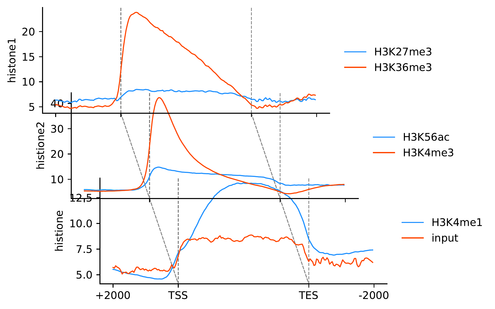
  <p><b>Figure 1:</b> Global Pseudo-3D profile showing multi-omics signal distribution across the genome.</p>
</div>


###### 2D Standard Mode
```bash
python 10_plot_whole_profile_2d3d.py \
  --mode 2d \
  --matrix-dir caculate_matrix \
  --group  "SRR8742373,SRR8742374;SRR8742375,SRR8742376;SRR8742377,SRR8742379" \
  --names  "H3K27me3,H3K36me3;H3K56ac,H3K4me3;H3K4me1,input" \
  --ylabels "histone1;histone2;histone" \
  --index-filter '' \
  --legend \
  --out whole_profile_gene_2d.pdf
```

<div align="center">
  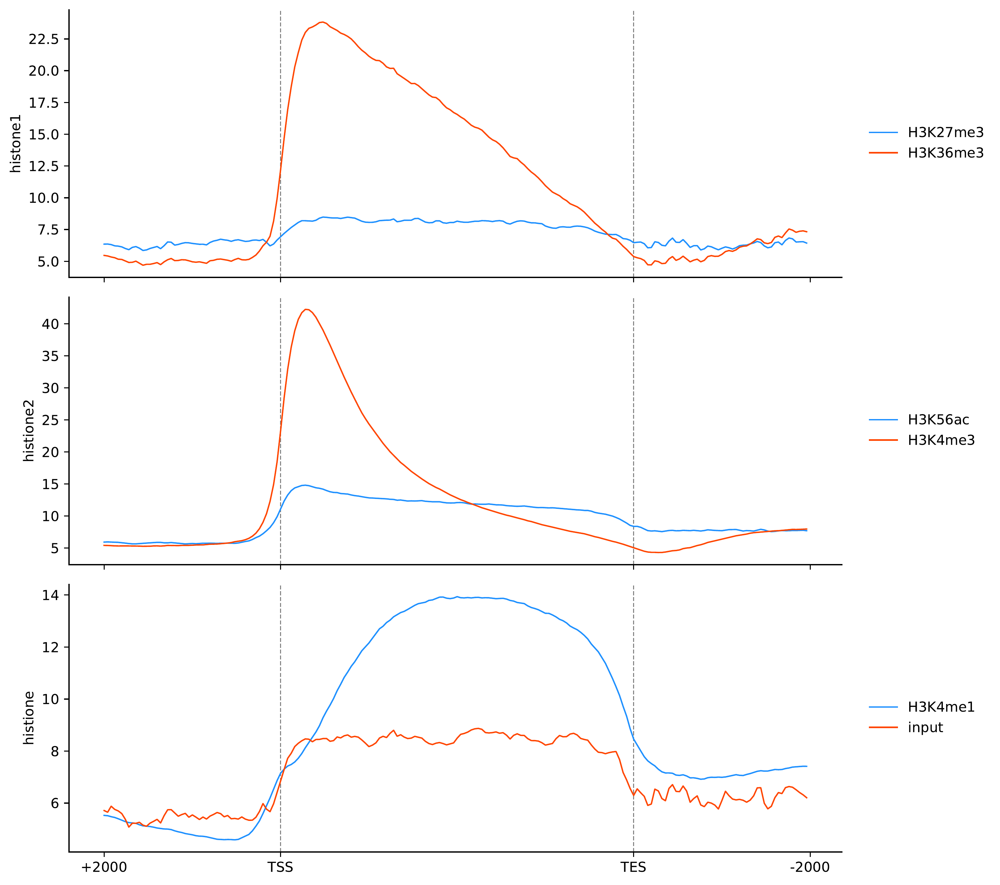
  <p><b>Figure 1:</b> Global Pseudo-3D profile showing multi-omics signal distribution across the genome.</p>
</div>


### 2. Signal vs. Expression Heatmap
Sort genes by expression level (High to Low) and visualize the corresponding epigenetic signal density.


```bash

python scripts/omicscanvas_histone_vs_expr_heatmap.py \
  --matrix-dir matrices \
  --tracks "H3K4me3" \
  --expr expression_FPKM.txt \
  --exp-bins 90 \
  --cmap RdBu_r \
  --out-prefix results/H3K4me3_vs_Expr
 ```

<table style="width: 100%; text-align: center; border-collapse: collapse; border: none;">
  <tr>
    <td style="border: none; width: 33%;">
      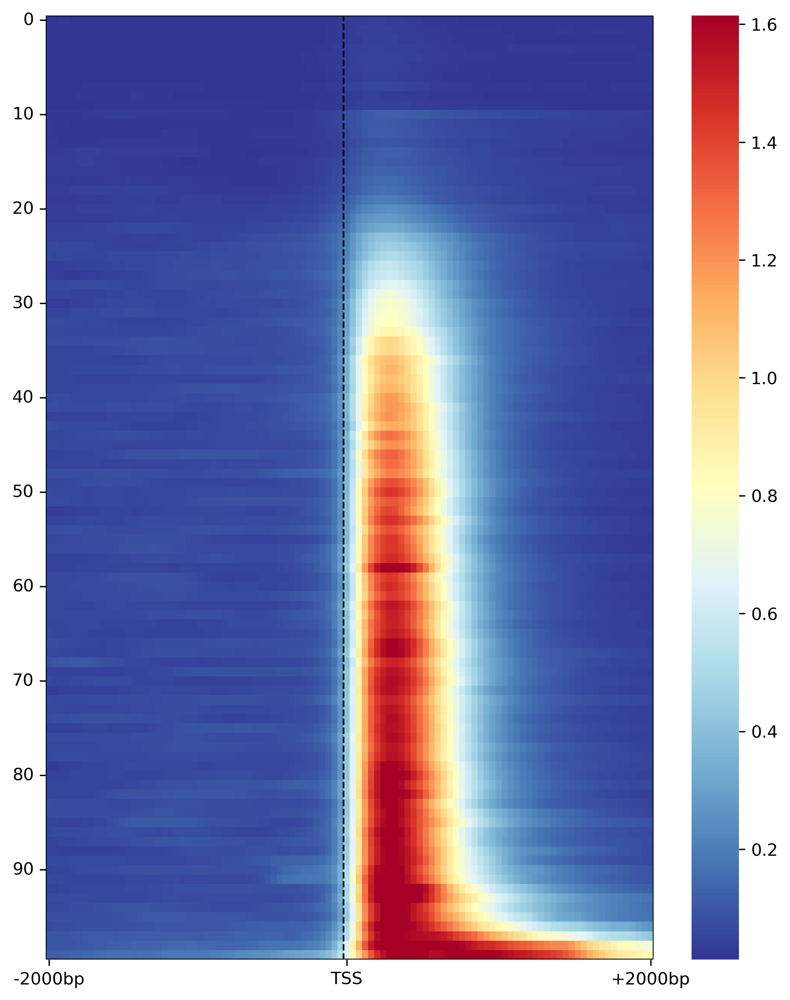
      <br>
      <p><i>Sample 1: H3K4me3 TSS Signal</i></p>
    </td>
    <td style="border: none; width: 33%;">
      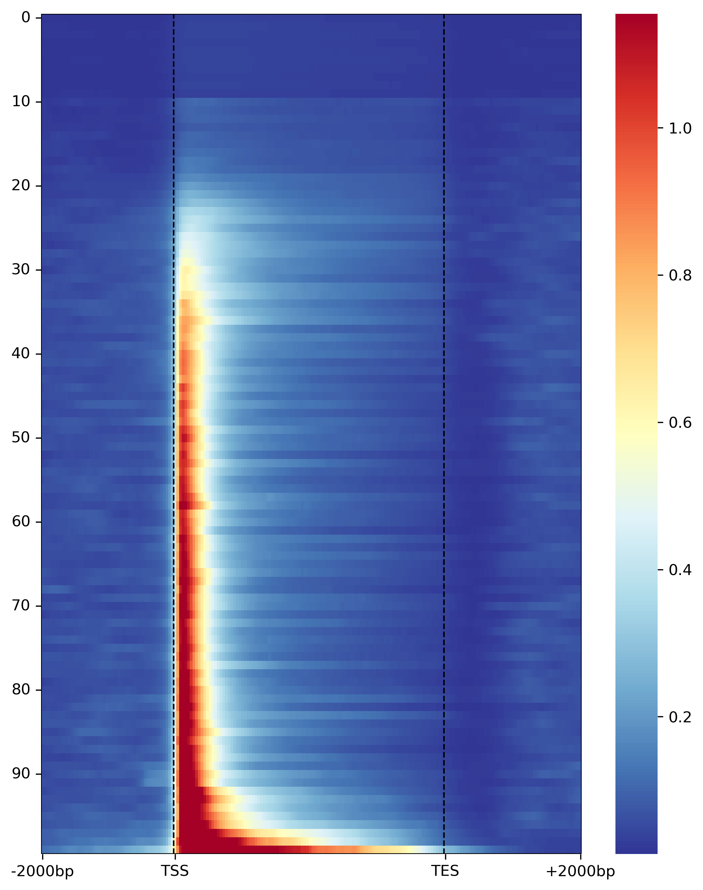
      <br>
      <p><i>Sample 2: H3K4me3 GeneBody Signal</i></p>
    </td>
    <td style="border: none; width: 33%;">
      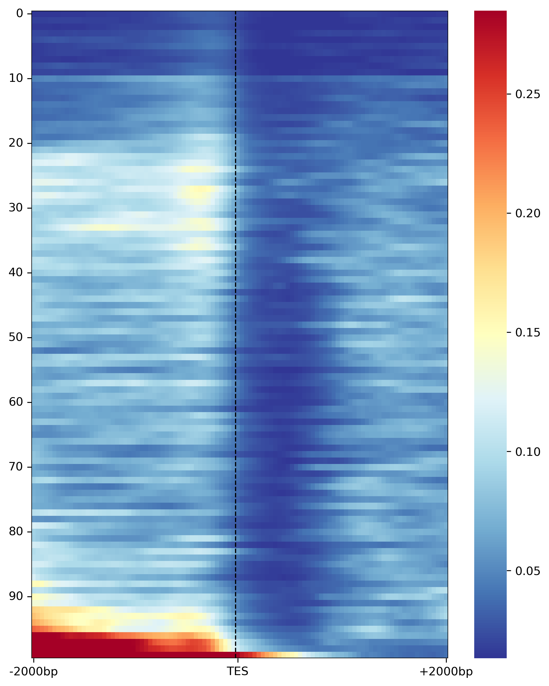
      <br>
      <p><i>Sample 3: H3K4me3 TES Signal</i></p>
    </td>
  </tr>
</table>


### 3. Clustering Analysis
Use K-means clustering to identify distinct chromatin states or regulatory patterns across samples.

```bash

python scripts/omicscanvas_histone_cluster_pipeline.py \
  --matrix-dir matrices \
  --in-group "Sample_H3K4me3;Sample_H3K27me3" \
  --k 4 \
  --out-prefix results/Clustering_Analysis
```


<table style="width: 100%; text-align: center; border-collapse: collapse; border: none;">
  <tr>
    <td style="border: none; width: 33%;">
      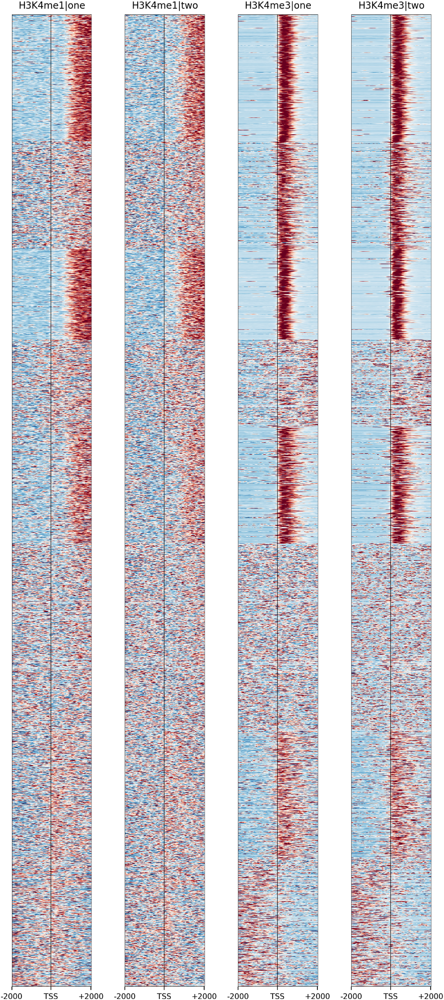
      <br>
      <p><i>Sample 1: H3K4me1 H3K4me3 TSS cluster heatmap Signal</i></p>
    </td>
    <td style="border: none; width: 33%;">
      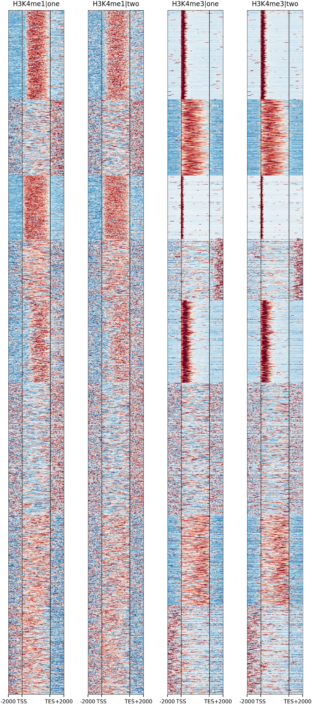
      <br>
      <p><i>Sample 2: H3K4me1 H3K4me3 Genebody cluster heatmap Signal</i></p>
    </td>
    <td style="border: none; width: 33%;">
      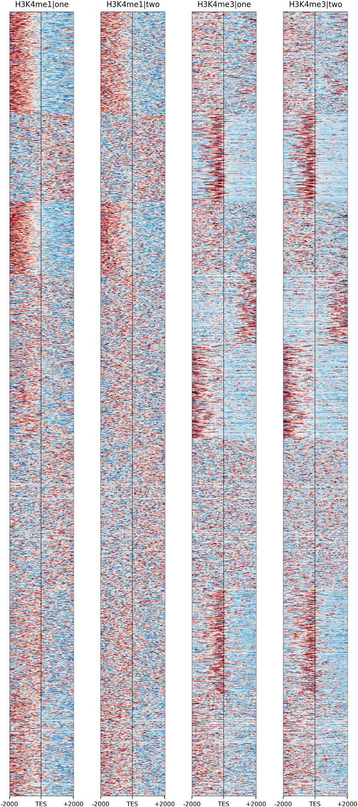
      <br>
      <p><i>Sample 3: H3K4me1 H3K4me3 TES cluster heatmap Signal</i></p>
    </td>
  </tr>
</table>


<table style="width: 100%; text-align: center; border-collapse: collapse; border: none;">
  <tr>
    <td style="border: none; width: 33%;">
      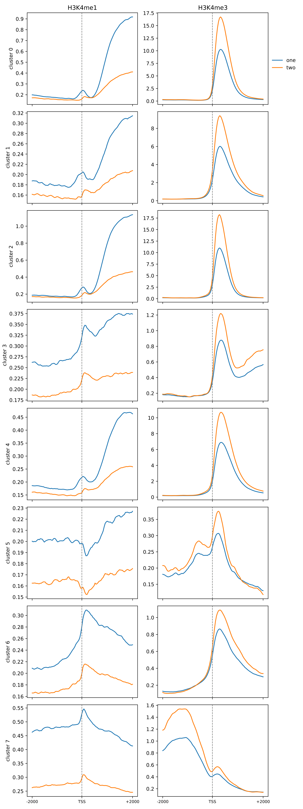
      <br>
      <p><i>Sample 1: H3K4me1 H3K4me3 TSS cluster heatmap Signal</i></p>
    </td>
    <td style="border: none; width: 33%;">
      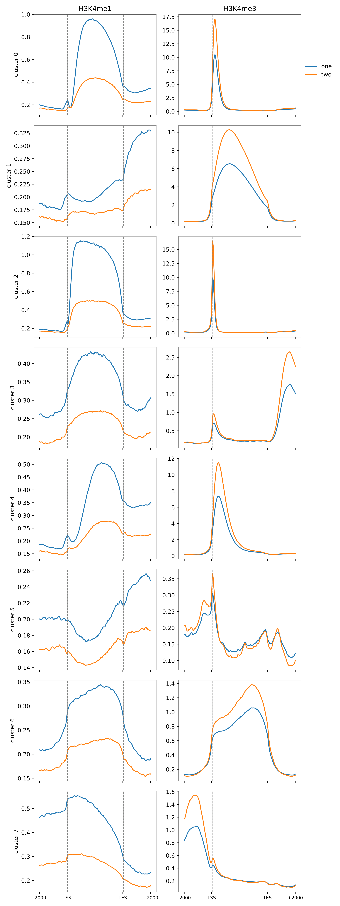
      <br>
      <p><i>Sample 2: H3K4me1 H3K4me3 Genebody cluster heatmap Signal</i></p>
    </td>
    <td style="border: none; width: 33%;">
      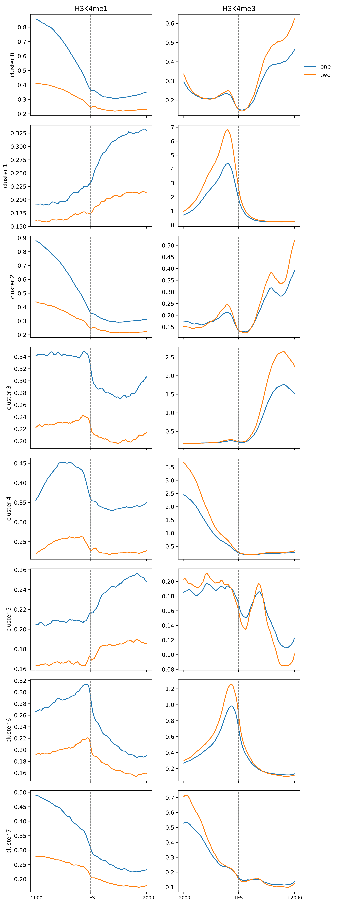
      <br>
      <p><i>Sample 3: H3K4me1 H3K4me3 TES cluster heatmap Signal</i></p>
    </td>
  </tr>
</table>


<div align="center">
  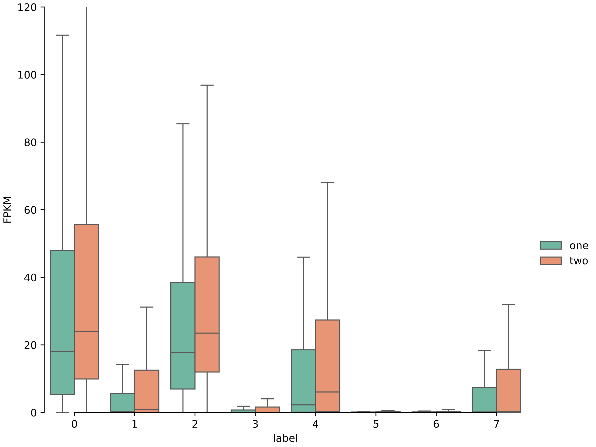
  <p><b>Figure: Gene Expression Distribution Across Clusters</b><br>
  <i>Boxplots showing the TPM/FPKM expression levels for each identified K-means cluster, highlighting the correlation between epigenetic signals and transcriptional activity.</i></p>
</div>


### 4. Single Gene Visualization (Pseudo-3D)
Zoom in on specific candidate genes. Stack ChIP-seq and RNA-seq tracks in a 3D layout to show co-occupancy.

```bash
python scripts/omicscanvas_gene_tracks_2d3d.py \
  --mode 3d \
  --gff3 annotation.gff3 \
  --gene Potri.006G061800 \
  --bam-dir bam_files \
  --bam-spec "H3K4me3.bam;H3K27me3.bam" \
  --out results/candidate_gene_3d.png
```

<div align="center">

  <h3>📍 Single-Gene Multi-Omics 2D Track</h3>
  
  <p><i>A high-resolution 2D visualization showing the distribution of epigenetic signals across the gene body and regulatory elements.</i></p>

  <br>

  <h3>🧊 Single-Gene Multi-Omics 3D Track</h3>
  
  <p><i>Enhanced Pseudo-3D perspective allowing for intuitive comparison of stacked signal intensities and co-occupancy patterns.</i></p>

</div>


### 5. Circular Gene Plot
Map genomic windows onto angular coordinates. Ideal for visualizing complex multi-layer regulation (e.g., Histone + Methylation) in a compact format.

```bash
python scripts/omicscanvas_gene_circle_plot.py \
  --gff3 annotation.gff3 \
  --gene Potri.006G061800 \
  --bam-spec "H3K4me3.bam;ATAC.bam" \
  --meth-spec "sample_CHH" \
  --circle-meth-layout combined \
  --out results/candidate_gene_circle.png
```

<div align="center">
  <h2>⭕ Interactive Gene Circular Visualization</h2>
  
  <br>
  <p align="center" style="width: 80%;">
    <b>Figure: Integrative Circular Track of Histone Modifications and Transcriptomics</b><br>
    <i>This circular coordinate framework maps multi-layer regulatory data (e.g., ChIP-seq signals and RNA-seq expression) onto an angular axis. It provides a compact yet comprehensive view of the epigenetic landscape and transcriptional activity for a specific candidate gene.</i>
  </p>
</div>


### 📚 Citation
If you use OmicsCanvas in your research, please cite:

OmicsCanvas: A multi-omics platform for integration and visualization of epigenetic and epitranscriptomic regulation. Zeyu Zhang, Zuoling Ma, Tian Hua, et al.

### ✉️ Contact
Issues: Please post feature requests or bugs to the Issues page.

Email: lfgu@fafu.edu.cn
