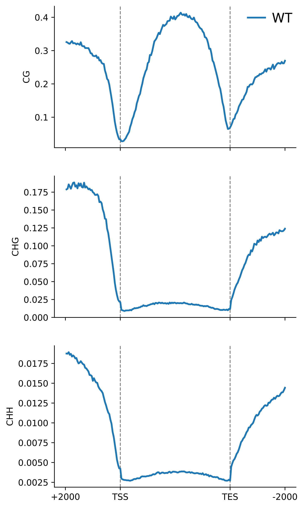
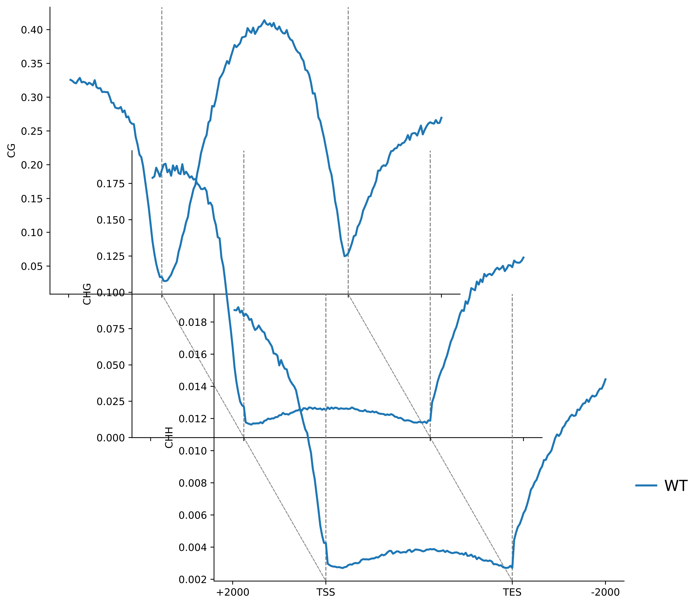
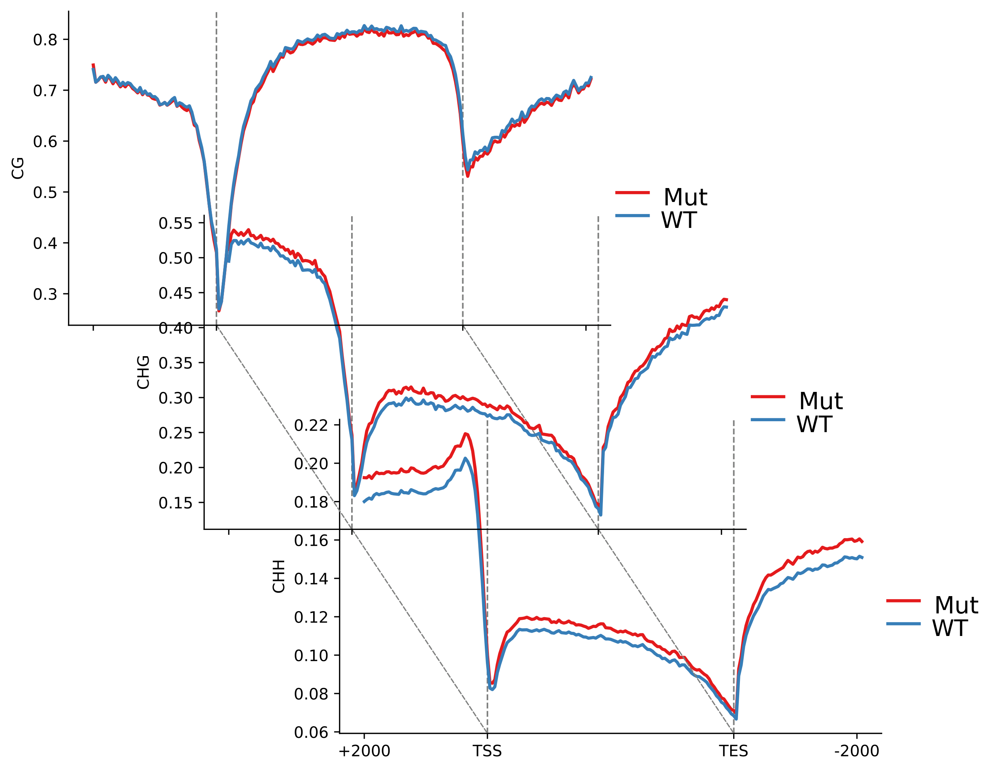

# OmicsCanvas: A Multi-Omics Integration & Visualization Toolkit

[](https://www.python.org/)
[](LICENSE)
[](CONTRIBUTING.md)

**A gene-architecture–aware framework to align, normalize, discover patterns, and visualize multi-omics regulation in a unified “promoter–gene body–flanks” coordinate system.** 

## 📖 Introduction
OmicsCanvas is a Python (v3.9) toolkit for integrated analysis of transcriptomic, epigenomic, and epitranscriptomic sequencing data. It takes peak-centric assays (e.g., ChIP-seq/ATAC-seq/m6A-seq) and projects their signals onto a standardized gene-architecture model, producing interpretable gene-centric matrices and publication-ready vector figures (PDF/SVG).

## 🔑 Key capabilities
- **Standardized inputs**: sorted/indexed **BAM** tracks (RNA-seq/ChIP-seq/ATAC-seq/m6A-seq, etc.), **GFF/BED** annotations, and **Bismark CX** methylation reports.  
- **Unified binning & matrix construction**: partitions each gene into body + flanks and discretizes into configurable bins (default **300**), generating unified *element × bin* signal matrices with optional library-size normalization. 
- **Expression & methylation integration**: outputs TPM/FPKM/count matrices and computes bin-level **CG/CHG/CHH** methylation profiles to directly connect regulatory layers with transcriptional output. 
- **Pattern discovery**: supports **K-means** to identify coordinated multi-track patterns and produce clustered heatmaps + profile summaries. 
- **Publication-ready visualization**: generates genome-wide metaplots/heatmaps and single-gene plots in **2D**, **pseudo-3D**, and **circular** layouts, with group-wise shared y-axis scaling for consistent comparisons.
- **Extended modules**: includes differential expression analysis via **PyDESeq2** and supports **TE-centric** quantification when TE annotations are provided.

---

## 📦 Installation

OmicsCanvas follows a minimal-dependency philosophy.

### Option A: Conda / Mamba (Recommended)
```bash
# Create environment
mamba create -n omicscanvas python=3.9 -y
mamba activate omicscanvas

# Install core scientific stack & bioinformatics tools
mamba install -c conda-forge numpy pandas matplotlib seaborn scipy scikit-learn -y
mamba install -c bioconda pysam -y
```

### Option B: Pip

```bash
pip install numpy pandas matplotlib scipy scikit-learn pysam seaborn
```


## 🚀 Usage & Workflow
The OmicsCanvas workflow consists of three main stages: Preparation, Matrix Calculation, and Visualization.

### Step 1: Preparation
#### 1.Convert your annotation (GFF3) into standard BED format and calculate gene lengths.
```bash

python scripts/01_prepare_gff_to_bed_genes_length.py 
  -i annotation.gff3 \
  -o gene.bed \
  -l gene_cds_length.tsv \
```
#### 2. Methylation Data Preprocessing (Bismark CX Reports)
Extract and filter site-specific methylation data (CG, CHG, and CHH contexts) from Bismark CX reports.

**Functionality:**
* Splits the global CX report into context-specific files (`CG`, `CHG`, `CHH`).
* Filters out high-depth noise (default threshold: depth > 300).
* Removes non-methylated sites (methylation count = 0) to reduce data redundancy.

```bash
# Extract and split methylation contexts
python scripts/02_prepare_cx_context_split.py \
  -i meth/sample_1_bismark_hisat2.CX_report.txt \
  -p sample \
  -d meth_data
```

Output: This script generates three context-specific files in the designated directory:
sample_CG.CX,sample_CHG.CX,sample_CHH.CX

Each output file is tab-delimited with 4 columns:
  * 1.Chromosome
  * 2.Position
  * 3.Methylated read counts
  * 4.depth

#### 3. Integration of Biological Replicates (Optional Step)
Combine multiple context-specific CX files from biological replicates into a single consensus file to improve data coverage and statistical confidence.

```bash
python scripts/03_prepare_cx_replicate_merge.py \
  -o meth_data/treatment_CG.CX \
  meth_data/treatment_rep1_CG.CX \
  meth_data/treatment_rep2_CG.CX
```


### Step 2: Matrix Generation
#### 1. For BAM Files (ChIP / ATAC / TFs / m6A-seq)
Convert sorted BAM files into gene-centric coverage matrices (Promoter, Body, Terminator).


```bash
python scripts/05_compute_bam_to_gene_matrices.py \
  -b Sample_H3K4me3.sorted.bam \
  -g gene.bed \
  --outdir matrices \
  --distance 2000 \
  --outdir caculate_matrix
  -o Sample_H3K4me3
```

> **Output:** This process generates three core matrix files: `Sample_H3K4me3_tss_matrix.tsv`, `Sample_H3K4me3_gene_profile_matrix.tsv`, and `Sample_H3K4me3_tes_matrix.tsv`.


#### 2. For Methylation (WGBS)
Process CX reports into gene-centric methylation matrices.

```bash
python scripts/06_compute_cx_gene_matrix.py -s sample -c CG -b gene.bed --cx-dir meth_data -o CX_gene
```

> **Output:** This process generates three core matrix files: `_tss_matrix.tsv`, `_gene_profile_matrix.tsv`, and `_tes_matrix.tsv`.

### 🎨 Visualization Gallery

---
#### 1. Single Gene Visualization (Pseudo-3D)
Zoom in on specific candidate genes. Stack ChIP-seq and RNA-seq tracks in a 3D layout to show co-occupancy.15_plot_gene_tracks_2d3d.py plot a single target gene as stacked “tracks” using BAM coverage (ChIP/ATAC/RNA, etc.).
It reads gene structure from a GFF3 (mRNA + exon/CDS/UTR), then computes coverage across [gene_start - distance, gene_end + distance] and draws:
  * --mode 2d : classic vertical stacked tracks
  * --mode 3d : pseudo-3D stacked tracks (offset panels + vertical dashed connectors)

##### Required / essential parameters (minimal set)
  * --mode        : 2d or 3d
  * --gff3        : genome annotation (GFF3)
  * --gene        : target transcript/gene ID that MUST match the mRNA ID in GFF3 (otherwise it will error)
  * --distance    : upstream/downstream window (bp)
  * --bam-dir     : directory containing BAM files
  * --bam-spec    : how BAM samples are grouped into layers/tracks
  * --name-spec   : track labels; MUST have exactly the same structure as --bam-spec
  * --fig-x/y     : figure size (inches)
  * --out         : output file (.pdf/.svg recommended)

##### How to specify samples (MOST IMPORTANT)
--bam-spec and --name-spec use the same layer syntax:
  * ';' separates groups (think: layers / rows)
  * ',' separates tracks within the same group

##### Example (3 layers, each layer has 2 tracks):
  * --bam-spec  "A.bam,B.bam;C.bam,D.bam;E.bam,F.bam"
  * --name-spec "H3K27me3,H3K36me3;H3K56ac,H3K4me3;RNA_1,RNA_2"
##### ⚠️ If the number of groups or tracks per group does NOT match between bam-spec and name-spec, the script will raise an error.


```bash
python 15_plot_gene_tracks_2d3d.py \
  --mode 2d \
  --gff3 genome/Ptrichocarpa_210_v3.0.gene.gff3 \
  --gene Potri.006G061800.1.v3.0 \
  --distance 2000 \
  --bam-dir bam \
  --bam-spec "SRR8742373.sorted.bam,SRR8742374.sorted.bam;SRR8742375.sorted.bam,SRR8742376.sorted.bam;SRR8742314.sorted.bam,SRR8742315.sorted.bam" \
  --name-spec "H3K27me3,H3K36me3;H3K56ac,H3K4me3;RNA_1,RNA_2" \
  --fig-x 12 --fig-y 6 \
  --out Potri.006G061800.1.v3.0_gene_track_2D.pdf
```

<div align="center">

  <h3>📍 Single-Gene Multi-Omics 2D Track</h3>
  
  <p><i>A high-resolution 2D visualization showing the distribution of epigenetic signals across the gene body and regulatory elements.</i></p>

</div>

```bash
python 15_plot_gene_tracks_2d3d.py \
  --mode 3d \
  --gff3 genome/Ptrichocarpa_210_v3.0.gene.gff3 \
  --gene Potri.006G061800.1.v3.0 \
  --distance 2000 \
  --bam-dir bam \
  --bam-spec "SRR8742373.sorted.bam,SRR8742374.sorted.bam;SRR8742375.sorted.bam,SRR8742376.sorted.bam;SRR8742314.sorted.bam,SRR8742315.sorted.bam" \
  --name-spec "H3K27me3,H3K36me3;H3K56ac,H3K4me3;RNA_1,RNA_2" \
  --fig-x 12 --fig-y 6 \
  --out Potri.006G061800.1.v3.0_gene_track_2D.pdf
```

<div align="center">

  <h3>🧊 Single-Gene Multi-Omics 3D Track</h3>
  
  <p><i>Enhanced Pseudo-3D perspective allowing for intuitive comparison of stacked signal intensities and co-occupancy patterns.</i></p>

</div>

### 2. Circular Gene Plot
---
Map genomic windows onto angular coordinates. Ideal for visualizing complex multi-layer regulation (e.g., Histone + Methylation) in a compact format.

#### Data preparation 
04_prepare_extract_gene_methylation.py (extract per-gene methylation TSV from CX files),This script extracts per-cytosine methylation records (CG/CHG/CHH) from precomputed CX files within a gene-centered window (±distance) and writes TSV outputs. These TSVs can be directly used by downstream single-gene visualization (e.g., Script 16).

##### What you need
  * GFF3 annotation (critical): the script matches your gene IDs using --feature-type (default: mRNA) and --attr-key (default: ID) from the GFF3 attributes.
    * If your IDs are on gene features, or the attribute key is not ID=, you must adjust --feature-type/--attr-key, otherwise it may fail with: No target IDs found...
  * CX directory: files must follow the naming rule: <SRR>_<CX><cx-suffix> (default --cx-suffix .CX), e.g. SRR8742373_CG.CX, SRR8742373_CHG.CX, SRR8742373_CHH.CX.

#### Output (for connecting to Script 16)

By default, outputs go to --outdir single_gene/. For each (SRR/prefix × gene × context), it generates a TSV:
  * <prefix>__<geneID>__CG.tsv / ...__CHG.tsv / ...__CHH.tsv (default --out-suffix .tsv).
  * Note: --srr one also works—because --srr is simply treated as the filename prefix. It will look for meth_data/one_CG.CX / one_CHG.CX / one_CHH.CX.
---

A:Single gene
```bash
python 04_prepare_extract_gene_methylation.py \
  -g Ptrichocarpa_210_v3.0.gene.gff3 \
  --cx-dir meth_data/ \
  --srr SRR8742373 \
  --gene Potri.001G055900.5.v3.0
```

B:Single sample + gene list
```bash
python 04_prepare_extract_gene_methylation.py \
  -g Ptrichocarpa_210_v3.0.gene.gff3 \
  --cx-dir meth_data/ \
  --srr SRR8742373 \
  --gene-list genes_list.txt
```
C Multiple samples in one run
```bash
python 04_prepare_extract_gene_methylation.py \
  -g Ptrichocarpa_210_v3.0.gene.gff3 \
  --cx-dir meth_data/ \
  --srr SRR8742373,SRR8742374,SRR8742375 \
  --gene-list genes_list.txt
```

#### Single-gene circle plot
16_plot_gene_circle_plot_ipynbmethod_groupylim_methfix.py (with/without methylation tracks),This script draws a single-gene circle plot, including BAM coverage tracks, and optionally CG/CHG/CHH methylation tracks.

##### Minimal required parameters
  * --gff3: annotation file (must contain the given --gene ID; otherwise it errors: “gene id not found in gff3”) 
  * --gene: target gene/transcript ID
  * --distance: upstream/downstream window
  * --out: output PDF

##### How to specify BAM samples: --bam-spec / --name-spec
  * --bam-spec: use ; to separate groups (layers/modules), and , to list BAMs within a group.
  * --name-spec: must match the structure of --bam-spec exactly (the script checks counts and will error if mismatched).


WITHOUT methylation
```bash
python script/python 16_plot_gene_circle_plot.py \
  --gff3 Ptrichocarpa_210_v3.0.gene.gff3 \
  --gene Potri.006G061800.1.v3.0 \
  --distance 2000 \
  --bam-dir bam \
  --bam-spec "SRR8742373.sorted.bam,SRR8742374.sorted.bam;SRR8742375.sorted.bam,SRR8742376.sorted.bam;SRR8742314.sorted.bam,SRR8742315.sorted.bam" \
  --name-spec "H3K27me3,H3K36me3;H3K56ac,H3K4me3;RNA_1,RNA_2" \
  --out Potri.006G061800.1.v3.0_gene_circle_no_meth.pdf
```


<div align="center">
  <h2>⭕ Interactive Gene Circular Visualization</h2>
  
  <br>
  <p align="center" style="width: 80%;">
    <b>Figure: Integrative Circular Track of Histone Modifications and Transcriptomics</b><br>
    <i>This circular coordinate framework maps multi-layer regulatory data (e.g., ChIP-seq signals and RNA-seq expression) onto an angular axis. It provides a compact yet comprehensive view of the epigenetic landscape and transcriptional activity for a specific candidate gene.</i>
  </p>
</div>

WITH methylation
```bash
python script/16_plot_gene_circle_plot.py \
  --gff3 genome/Ptrichocarpa_210_v3.0.gene.gff3 \
  --gene Potri.001G031400.1.v3.0 \
  --distance 2000 \
  --bam-dir bam \
  --bam-spec "SRR8742373.sorted.bam,SRR8742374.sorted.bam;SRR8742375.sorted.bam,SRR8742376.sorted.bam;SRR8742314.sorted.bam,SRR8742315.sorted.bam" \
  --name-spec "H3K27me3,H3K36me3;H3K56ac,H3K4me3;RNA_1,RNA_2" \
  --meth-dir single_gene \
  --meth-spec one__Potri.001G031400.1.v3.0 \
  --circle-meth-layout combined \
  --out Potri.001G031400.1.v3.0_gene_circle_with_meth.pdf
```


<div align="center">
  <h2>⭕ Interactive Gene Circular Visualization</h2>
  
  <br>
  <p align="center" style="width: 80%;">
    <b>Figure: Integrative Circular Track of Histone Modifications and Transcriptomics</b><br>
    <i>This circular coordinate framework maps multi-layer regulatory data (e.g., ChIP-seq signals and RNA-seq expression) onto an angular axis. It provides a compact yet comprehensive view of the epigenetic landscape and transcriptional activity for a specific candidate gene.</i>
  </p>
</div>


#### 📊 Global Multi-Omics Profile (Pseudo-3D)
The 10_plot_whole_profile_2d3d.py script visualizes the genome-wide distribution of histone modifications or chromatin accessibility. It aggregates genes × bins matrices (via mean/median) into 1D meta-profiles and supports two sophisticated visualization modes:
  * 2D mode: vertically stacked panels;
  * 3D mode: stacked “fake-3D” panels in a column using x/y offsets and vertical dashed connectors.

---
##### 📂 Input Matrices (Source & Naming)

Matrices are typically pre-computed (e.g., via `06_compute_cx_gene_matrix.py`). The script dynamically loads files using the following mapping logic:

**Path Construction:**
`Path = <matrix-dir> / <sample_prefix> + <suffix>`


| Gene Type (`--gene-type`) | Standard Suffix | Description |
| :--- | :--- | :--- |
| `tss` | `_tss_matrix.tsv` | Transcription Start Site window |
| `gene` | `_gene_profile_matrix.tsv` | TSS + Scaled Gene Body + TES |
| `tes` | `_tes_matrix.tsv` | Transcription End Site window |

> **💡 Note:** The `sample_prefix` is parsed directly from the names provided in your `--group` argument. Ensure the file names in your directory strictly match this prefix.

---

#### 🛠 Layout Syntax: The Core Logic

The script uses a unique "Layout Language" for `--group`, `--names`, and `--ylabels`. Mastering the separators is critical for organizing your plot:

##### 🔗 Separator Rules
* **`,` (Comma)**: Groups multiple samples into the **same panel** (rendered as multiple lines).
* **`;` (Semicolon)**: Stacks **panels** vertically within the same column.
* **`|` (Pipe)**: Starts a **new column**.

##### ⚠️ Hard Rules
1.  **Strict Symmetry**: `--names` must mirror the structure of `--group` exactly (identical column, panel, and line counts).
2.  **Label Mapping**: `--ylabels` defines exactly one label per panel (use `;` and `|` to separate, **do not** use commas).

---

#### 🚀 Quick Start Examples

##### 1. 3D Stacked Mode (6 Samples → 3 Overlaid Panels)
Ideal for visualizing "layers" of epigenetic information with depth.

```bash
python scripts/10_plot_whole_profile_2d3d.py \
  --mode 3d \
  --matrix-dir caculate_matrix \
  --group "SRR8742373,SRR8742374;SRR8742375,SRR8742376;SRR8742377,SRR8742379" \
  --names "H3K27me3,H3K36me3;H3K56ac,H3K4me3;H3K4me1,input" \
  --ylabels "histone1;histone2;histone" \
  --index-filter '' \
  --line-colors 'dodgerblue,orangered' \
  --legend \
  --out whole_profile_gene_3d.pdf
 ```

<div align="center">
  
  <p><b>Figure 1:</b> Global Pseudo-3D profile showing multi-omics signal distribution across the genome.</p>
</div>


###### 2D Standard Mode
```bash
python scripts/10_plot_whole_profile_2d3d.py \
  --mode 2d \
  --matrix-dir caculate_matrix \
  --group  "SRR8742373,SRR8742374;SRR8742375,SRR8742376;SRR8742377,SRR8742379" \
  --names  "H3K27me3,H3K36me3;H3K56ac,H3K4me3;H3K4me1,input" \
  --ylabels "histone1;histone2;histone" \
  --index-filter '' \
  --legend \
  --out whole_profile_gene_2d.pdf
```

<div align="center">
  
  <p><b>Figure 1:</b> Global Pseudo-3D profile showing multi-omics signal distribution across the genome.</p>
</div>

#### 📊 Whole-profile methylation plot (2D / 3D)
This script draws whole-profile DNA methylation curves across contexts (e.g., CG/CHG/CHH) in either:
  * 2D: one panel per context (stacked vertically)
  * 3D: pseudo-3D layered panels (offset axes per context)

##### Input requirements

###### File naming convention (critical)
The script loads files using this pattern:
<meth_dir>/<sample_id>_<context><whole_suffix> 

##### Example (matching your command with --whole-suffix _profile.tsv):
```bash
CX_gene/WT_CG_profile.tsv
CX_gene/WT_CHG_profile.tsv
CX_gene/WT_CHH_profile.tsv
CX_gene/Mut_CG_profile.tsv
CX_gene/Mut_CHG_profile.tsv
CX_gene/Mut_CHH_profile.tsv
```
##### Must-have parameters (you should document clearly)
  * --meth-dir
  Directory containing whole-profile files. Files are discovered by the naming rule above. 
  * --samples
  Comma-separated sample IDs used in filenames (e.g., WT,Mut). 
  * --labels
  Comma-separated legend labels in the same order as --samples. 
  * --contexts
  Comma-separated contexts to plot (e.g., CG,CHG,CHH). This also controls panel/layer order. 
  * --whole-suffix
  Suffix of the profile files. Default is _whole_line.txt.
  If your files are named like <sample>_<context>_profile.tsv, use --whole-suffix _profile.tsv. 
  * --out-prefix
  Output prefix. The script writes <prefix>.2D.pdf and/or <prefix>.3D.pdf into the current directory. 
  * --mode
  Choose outputs: 2d, 3d, or both (default: both). 


2D example
```bash
python script/13_plot_methylation_profile_2d3d.py \
  --mode 2d \
  --meth-dir CX_gene \
  --contexts CG,CHG,CHH \
  --samples WT \
  --labels WT \
  --out-prefix WT_CX_profile_2D \
  --whole-suffix _profile.tsv \
  --fig-x 5 --fig-y 10
```

<div align="center">
  
  <p><b>Figure: Gene Expression Distribution Across Clusters</b><br>
  <i>Boxplots showing the TPM/FPKM expression levels for each identified K-means cluster, highlighting the correlation between epigenetic signals and transcriptional activity.</i></p>
</div>


3D example
```bash
python script/13_plot_methylation_profile_2d3d.py \
  --mode 3d \
  --meth-dir CX_gene \
  --contexts CG,CHG,CHH \
  --samples WT \
  --labels WT \
  --out-prefix WT_CX_profile_3D \
  --whole-suffix _profile.tsv \
  --y-offset 50 \
  --fig-x 10 --fig-y 10
```

<div align="center">
  
  <p><b>Figure: Gene Expression Distribution Across Clusters</b><br>
  <i>Boxplots showing the TPM/FPKM expression levels for each identified K-means cluster, highlighting the correlation between epigenetic signals and transcriptional activity.</i></p>
</div>


Multi-sample 3D
```bash
python script/13_plot_methylation_profile_2d3d.py \
  --mode 3d \
  --meth-dir CX_gene \
  --contexts CG,CHG,CHH \
  --samples WT,Mut \
  --labels WT,Mut \
  --whole-suffix _profile.tsv \
  --out-prefix WT_vs_Mut_CX \
  --line-colors "#1f77b4,#d62728" \
  --fig-x 10 --fig-y 10
```

<div align="center">
  
  <p><b>Figure: Gene Expression Distribution Across Clusters</b><br>
  <i>Boxplots showing the TPM/FPKM expression levels for each identified K-means cluster, highlighting the correlation between epigenetic signals and transcriptional activity.</i></p>
</div>


### 2. Signal vs. Expression Heatmap
Sort genes by expression level (High to Low) and visualize the corresponding epigenetic signal density. 11_plot_histone_vs_expr_heatmap.py generates a “histone/ATAC signal vs expression-binned” global trend heatmap.It loads *_tss_matrix.tsv / *_gene_profile_matrix.tsv / *_tes_matrix.tsv matrices produced by omicscanvas_bam_to_gene_matrices.py,integrates an expression table (e.g., FPKM/TPM) to rank genes, splits them into non-expressed and expressed bins,and aggregates signals (e.g., mean) within each bin to produce the heatmap.


##### Input Preparation
------------------------------------------------------------
By default, the script reads matrices using the standard suffix naming:
  --matrix-dir: Matrix directory
  *_tss_matrix.tsv
  *_gene_profile_matrix.tsv
  *_tes_matrix.tsv

So your --matrix-dir typically contains files like:

  SRR8742373_gene_profile_matrix.tsv
  SRR8742373_tss_matrix.tsv
  SRR8742373_tes_matrix.tsv
  ... (same pattern for other tracks)

  If you are using legacy suffix naming, you can override them with:
    --suffix-tss / --suffix-gene / --suffix-tes

  --expr: Expression table (TSV)
  The expression file must have:
  - The first column as gene ID (used as the index)
  - Subsequent columns as expression values

  Use --expr-cols to specify which columns are used to compute the mean expression
  (0-based indexing, counting columns AFTER the gene ID index column).

------------------------------------------------------------

##### Required Parameters (Key points)
------------------------------------------------------------
- --matrix-dir: Matrix directory (required)
- --tracks: Track(s) to plot (required; pay attention to the input format)
- --gene-types: Region type to plot: gene / TSS / TES (default: gene)
- --expr: Expression TSV file (required)
- --expr-cols: Expression columns (default: 0,1,2; here you use: 0,1)
- --out-prefix / --outdir / --out-format: Output filename prefix, output directory, and output format (pdf/png)

Other commonly used (optional) parameters:
- --none-bins / --exp-bins: Number of bins for non-expressed vs expressed genes
- --distance: Upstream/downstream window size used when building the matrices
- --cmap: Colormap for the heatmap
- --scale-mode / --quantiles: How to scale values (e.g., quantile clipping)
------------------------------------------------------------

```bash

python 11_plot_histone_vs_expr_heatmap.py \
  --matrix-dir caculate_matrix \
  --tracks "SRR8742376" \
  --gene-types TSS \
  --expr FPKM.txt \
  --expr-cols 0,1 \
  --none-bins 10 \
  --exp-bins 90 \
  --distance 2000 \
  --cmap RdBu_r \
  --scale-mode quantile \
  --quantiles 0.01,0.99 \
  --out-format pdf \
  --out-prefix H3K4me3_TSS \
  --outdir out_heatmap

python 11_plot_histone_vs_expr_heatmap.py \
  --matrix-dir caculate_matrix \
  --tracks "SRR8742376" \
  --gene-types gene \
  --expr FPKM.txt \
  --expr-cols 0,1 \
  --none-bins 10 \
  --exp-bins 90 \
  --distance 2000 \
  --cmap RdBu_r \
  --scale-mode quantile \
  --quantiles 0.01,0.99 \
  --out-format pdf \
  --out-prefix H3K4me3_gene \
  --outdir out_heatmap

python 11_plot_histone_vs_expr_heatmap.py \
  --matrix-dir caculate_matrix \
  --tracks "SRR8742376" \
  --gene-types TES \
  --expr FPKM.txt \
  --expr-cols 0,1 \
  --none-bins 10 \
  --exp-bins 90 \
  --distance 2000 \
  --cmap RdBu_r \
  --scale-mode quantile \
  --quantiles 0.01,0.99 \
  --out-format pdf \
  --out-prefix H3K4me3_TES \
  --outdir out_heatmap

 ```

<table style="width: 100%; text-align: center; border-collapse: collapse; border: none;">
  <tr>
    <td style="border: none; width: 33%;">
      
      <br>
      <p><i>Sample 1: H3K4me3 TSS Signal</i></p>
    </td>
    <td style="border: none; width: 33%;">
      
      <br>
      <p><i>Sample 2: H3K4me3 GeneBody Signal</i></p>
    </td>
    <td style="border: none; width: 33%;">
      
      <br>
      <p><i>Sample 3: H3K4me3 TES Signal</i></p>
    </td>
  </tr>
</table>

### 3. Mehtylation vs. Expression Heatmap
14_plot_meth_vs_expr_heatmap.py ranks genes by expression (FPKM/TPM/Counts), bins them, then computes methylation ratio sum(me)/sum(al) for each expression bin along a merged gene profile (start/body/end concatenated) and outputs a heatmap PDF. 

##### Required inputs
  (1) Three methylation segment tables under --meth-dir (built from --sample, --cx, and suffixes):
  * <meth_dir>/<sample>_<CX>_upstream_bins50.tsv
  * <meth_dir>/<sample>_<CX>_body_bins100.tsv
  * <meth_dir>/<sample>_<CX>_downstream_bins50.tsv
  Each file must contain at least: name, bin/po, me, al (the script also tolerates your common index_col=0 format). 
  (2) Expression table (TSV) via --FPKM/TPM: row index must be gene IDs; --fpkm-cols selects columns (0-based, excluding the index) to average. (consistent with Signal vs. Expression Heatmap)
  If methylation genes and expression genes have no overlap, the script will error out.

##### Required Parameters (Key points)

--sample (required): sample ID used to build methylation filenames 
--cx (required): methylation context (CG/CHG/CHH) 
--meth-dir: methylation segment directory (default gene/) 
--fpkm (required): expression table path 
--fpkm-cols: expression columns to average 
--none-bins, --exp-bins: numbers of bins (controls heatmap rows) 
--out-prefix: output prefix (optional; defaults to --sample) 
Output is always:
<out-prefix>_<sample>_<CX>_meth_vs_expr_heatmap.pdf

```bash
python script/14_plot_meth_vs_expr_heatmap.py \
  --sample one \
  --cx CG \
  --meth-dir CX_gene \
  --fpkm FPKM.txt \
  --fpkm-cols 0,1 \
  --none-bins 10 \
  --exp-bins 90 \
  --distance 2000 \
  --scale-mode ratio \
  --cmap RdBu_r \
  --out-prefix one --allow-unequal-segments
```

### 3. Clustering Analysis
Use K-means clustering to identify distinct chromatin states or regulatory patterns across samples.

```bash
python scripts/12_plot_histone_cluster_pipeline.py \
  --matrix-dir caculate_matrix --in-group "one_H3K4me1,two_H3K4me1;one_H3K4me3,two_H3K4me3" \
  --in-names "one,two;one,two" \
  --fpkm out_DE/matrices/merged_FPKM.tsv \
  --expr-cols "one=0,1,2;two=3,4,5" \
  --cluster-region gene \
  --plot-regions TSS,gene,TES \
  --k 8 \
  --vmin -2 \
  --vmax 2 \
  --out-prefix GBR_histone \
  --in-ylabels "H3K4me1,H3K4me3" \
  --panel-figsize "15,15" \
  --outdir out_histone_cluster \
```


<table style="width: 100%; text-align: center; border-collapse: collapse; border: none;">
  <tr>
    <td style="border: none; width: 33%;">
      
      <br>
      <p><i>Sample 1: H3K4me1 H3K4me3 TSS cluster heatmap Signal</i></p>
    </td>
    <td style="border: none; width: 33%;">
      
      <br>
      <p><i>Sample 2: H3K4me1 H3K4me3 Genebody cluster heatmap Signal</i></p>
    </td>
    <td style="border: none; width: 33%;">
      
      <br>
      <p><i>Sample 3: H3K4me1 H3K4me3 TES cluster heatmap Signal</i></p>
    </td>
  </tr>
</table>


<table style="width: 100%; text-align: center; border-collapse: collapse; border: none;">
  <tr>
    <td style="border: none; width: 33%;">
      
      <br>
      <p><i>Sample 1: H3K4me1 H3K4me3 TSS cluster heatmap Signal</i></p>
    </td>
    <td style="border: none; width: 33%;">
      
      <br>
      <p><i>Sample 2: H3K4me1 H3K4me3 Genebody cluster heatmap Signal</i></p>
    </td>
    <td style="border: none; width: 33%;">
      
      <br>
      <p><i>Sample 3: H3K4me1 H3K4me3 TES cluster heatmap Signal</i></p>
    </td>
  </tr>
</table>


<div align="center">
  
  <p><b>Figure: Gene Expression Distribution Across Clusters</b><br>
  <i>Boxplots showing the TPM/FPKM expression levels for each identified K-means cluster, highlighting the correlation between epigenetic signals and transcriptional activity.</i></p>
</div>


### 📚 Citation
If you use OmicsCanvas in your research, please cite:

OmicsCanvas: A multi-omics platform for integration and visualization of epigenetic and epitranscriptomic regulation. Zeyu Zhang, Zuoling Ma, Tian Hua, et al.

### ✉️ Contact
Issues: Please post feature requests or bugs to the Issues page.

Email: lfgu@fafu.edu.cn
